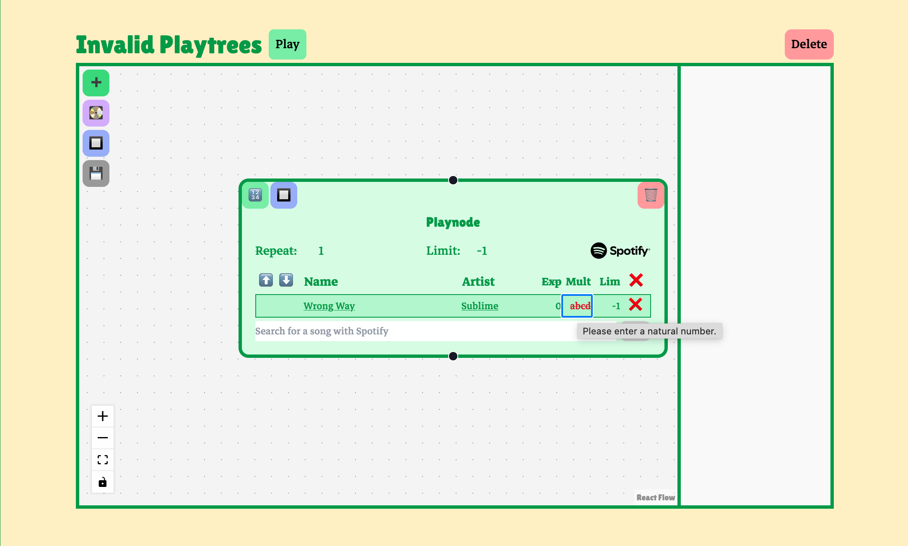
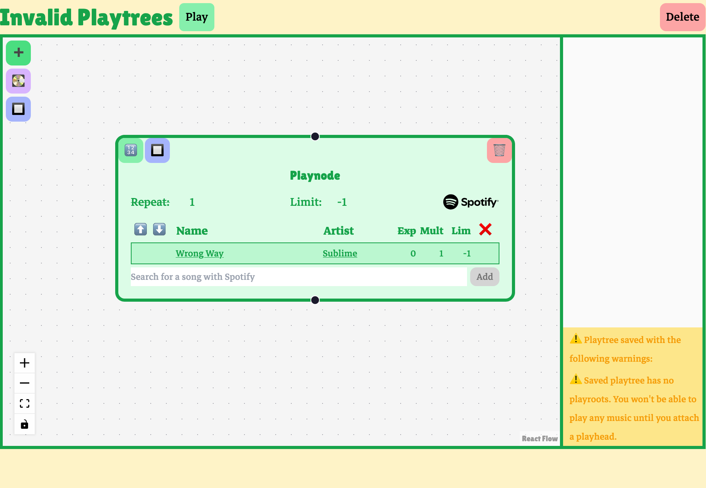
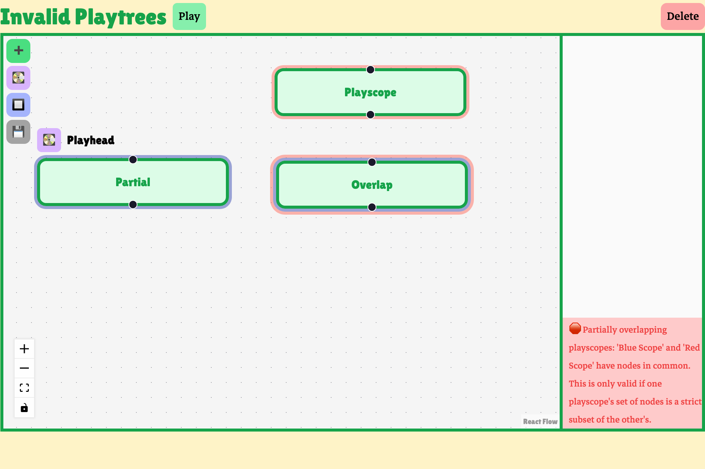

+++
date = '2025-03-19T14:36:22-07:00'
draft = true
title = 'Playtree Editor UI'
tags = ['playtree', 'challenge']
[params]
    rank = 22
+++

### Synchronizing Playtree data with React Flow UI
I wanted to create an intuitive, fun UI for making and visualizing complex playtrees. Playtrees are graph structures, so I used [React Flow](https://reactflow.dev/), a library for rendering and interacting with graphs. The editor displays highly customized nodes and edges using React Flow. I'll call these nodes and edges that appear in the editor's UI "flow nodes" and "flow edges." These flow nodes and flow edges are distinct from playnodes and playedges, which are represented in data within a playtree data structure, which exists as a JSON file when stored on the server, and a Typescript object when used in the editor or player component on the Playtree client. Even so, the custom flow nodes and flow edges used in the editor UI do depend on the data with a playnode and playedge.

I wanted to keep the playtree data structure, as maintained on the server, as the editor's source of truth. Keeping the React Flow UI synced with the playtree data required an awareness of React's [reconciliation algorithm](https://18.react.dev/learn/preserving-and-resetting-state). If React cannot determine that a node remains the same from one render to another, for example, it will destroy the underlying HTML and recreate it for the next render. This isn't only a performance issue; in some cases, it will lead to critical UI bugs like losing focus on an text input while typing. A user encountering this would have to manually refocus a text field after every character they type. This is an unacceptable usability issue. I carefully synchronized the central playtree state with the React Flow UI state to ensure a clean data flow while avoiding UI bugs.

---

### Client-side validation

#### Input validation
Many of the rules governing valid playtrees are implicitly enforced by the editor's UI. Using the UI will always lead to a syntactically well-formed playtree file, for example, and things like generating unique identifiers for playnodes and managing indices for songs are all handled automatically.

In some cases, however, the UI still allows a user to make invalid playtrees. For example, the user can enter invalid input in one of the text fields. An error decoration is added to invalid input fields, and the parameter will be set to its default value on save if the user doesn't correct the input first.

#### Validation on save
Some features involve ensuring graph-wide invariants and are therefore checked before a playtree is saved. The editor will issue a warning if a user's playtree doesn't have a playroot. If no playroot is assigned to a playnode, playback can't start anywhere.

This playtree is considered valid; it doesn't violate any playtree rules. Still, the user probably didn't intend to make a playtree that doesn't start playback anywhere, and so they are issued a warning.

The editor also checks if a user's playscopes are valid. Playscopes can't partially overlap other playscopes, or be redundant. A playtree with invalid playscopes can't unambiguously apply scope rules, and so it is invalid as a playtree.

When the user tries to save an invalid playtree, an error is reported in the editor. Notice that the save icon is still visible. Invalid playtrees are not saved to the server.
