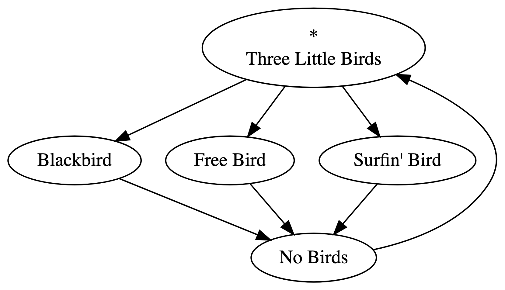
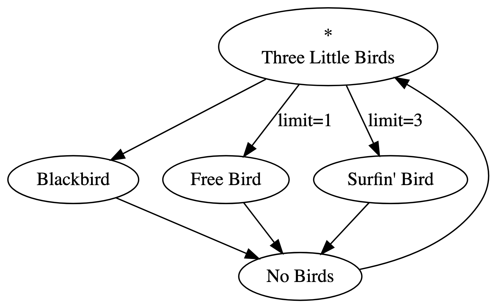
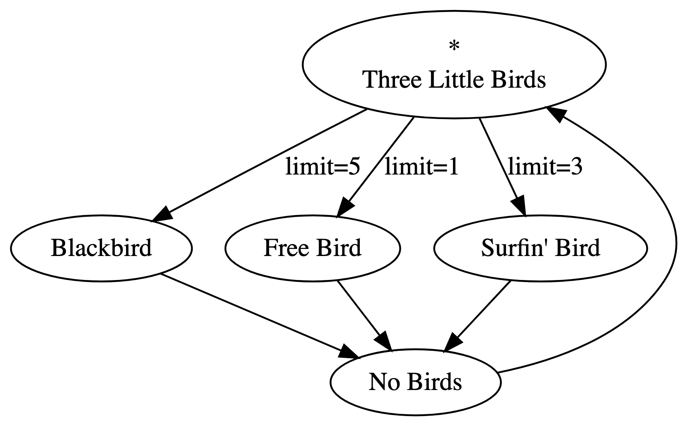
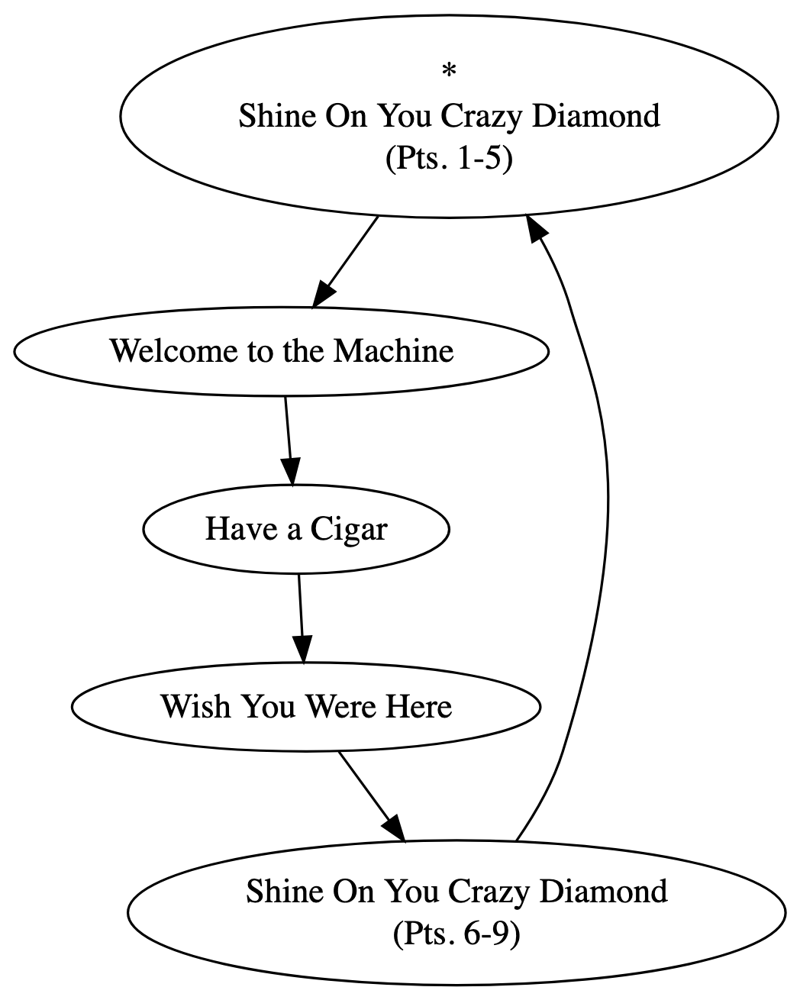
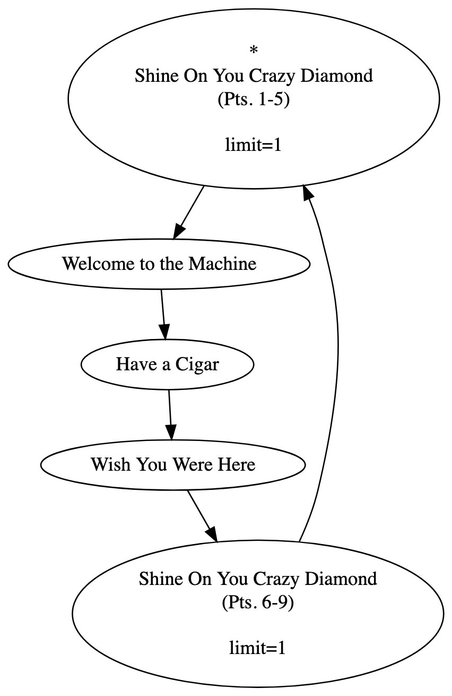

+++
date = '2025-03-21T19:44:56-07:00'
draft = true
title = 'Playtree Limits Explained'
+++
In this post, I'll explain how limits work in Playtree.

### Limiting Playedges

This playtree will start at "Three Little Birds," play one of "Blackbird," "Free Bird," or "Surfin' Bird," play "No Birds," and then repeat forever. In case you're not familiar with these tunes, "Free Bird" is over 9 minutes long, and "Surfin' Bird" is best enjoyed in moderation. You might want to set a limit on how many times those songs can be selected.

Let's put some limits on our playtree:

Now, the playedge to "Free Bird" can only be chosen once. The next time "Three Little Birds" finishes playing, that edge will not be considered in the selection process. One of the two remaining edges will be selected. "Surfin' Bird" can be chosen three times, after which it will be removed from consideration. After "Free Bird" plays once and "Surfin' Bird" plays three times, "Blackbird" will always play after "Three Little Birds."

Suppose you've had your fill even of the beautifully simple "Blackbird." You set the edge leading into it to 5:

Now, each of "Three Little Bird"'s outgoing playedges are limited. After it plays enough times, none of its outgoing edges will be eligible for selection. When this happens, the node is treated as though it has no outgoing edges, and playback terminates.

---

### Limiting Playnodes

The songs that bookend this fantastic album are 12+ minutes each! You might want to hear them once while leaving the other songs on loop. But, if we limit their incoming playedges, then "Shine On You Crazy Diamond (Pts. 1-5)" will play twice, and playback will terminate after "Wish You Were Here" is played a second time. Instead, we can set a limit on the *playnodes*. Playback will still follow edges coming in and out of a limited playnode, but playback will pass through without playing the song the playnode contains:

In this playtree, all songs will play through once, and then on the second pass, playback will skip "Shine On You Crazy Diamond (Pts. 1-5)" and pass through to "Welcome to the Machine." After "Wish You Were Here" finishes a second time, playback will pass through both Crazy Diamonds and on to "Welcome to the Machine" again.

Playback iteratively passes through limited nodes until it finds something to play. It's possible to make a playtree that infinitely cycles through nodes that are all limited. In such a scenario, playback will try to find a node up to a maximum number of iterations (currently set to 10,000), at which point playback will terminate as a failsafe.