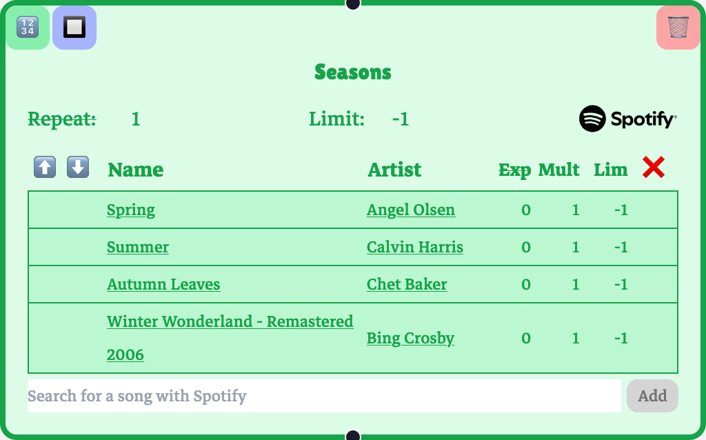
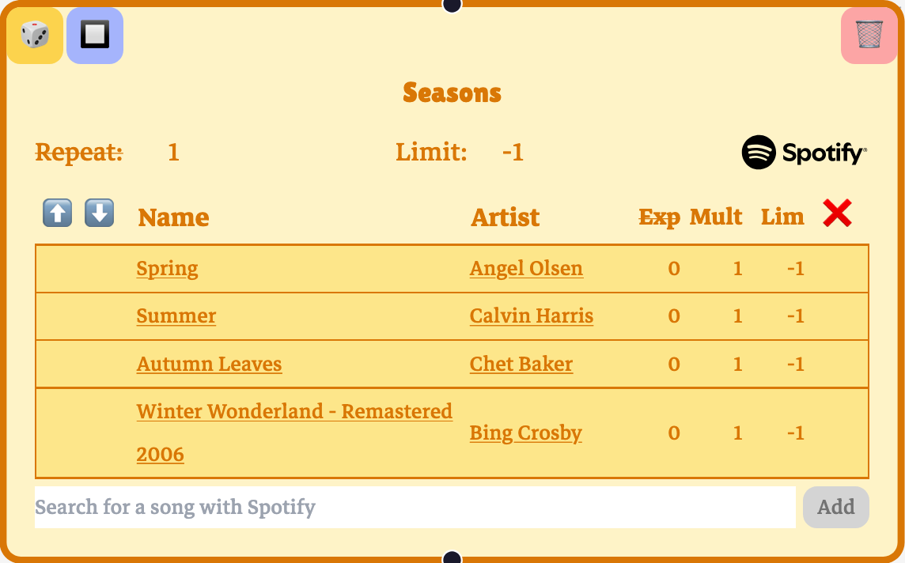
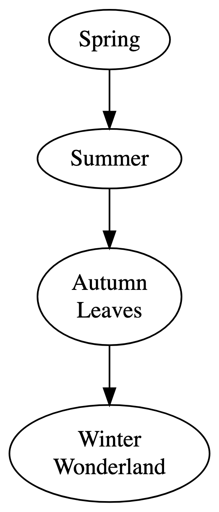
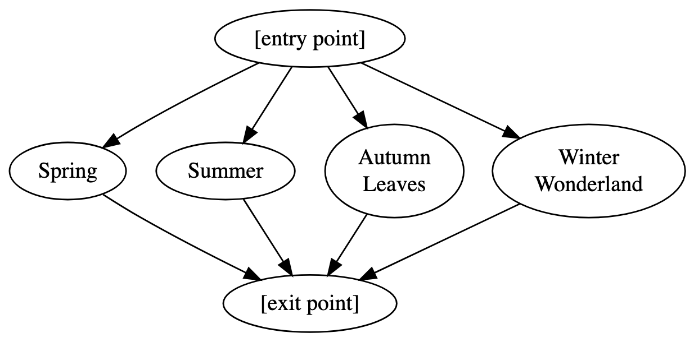

+++
date = '2025-03-22T14:52:03-07:00'
draft = true
title = 'Playtree Playnode Types Explained'
tags = ['playtree', 'explainer']
[params]
    rank = 103
+++
Up to this point, playnodes have contained a single song. In practice, though, it would be tedious to have to make a playnode and playedges for every single song you want in a playtree. The playnodes in the Playtree app are containers for any number of songs. Because playnodes can handle collections of songs, it opens the possibility of adding whole playlists into a playnode.

Playnodes come in two types: **sequencers** and **selectors**.

### Sequencer playnodes
A sequencer takes each of its songs and plays them all in order before passing playback to a playedge.

This is a sequencer playnode, designated with the number icon and the green color. It plays "Spring," then "Summer," then "Autumn Leaves," then "Winter Wonderland," and then playback moves to one of its outgoing playedges.

Here, you'll see that the playnode's limit is set to `-1`. This means that the playnode doesn't have a limit on the number of times it can play. You might also notice the repeat parameter to the left of the limit. A repeat value of `3`, for example, will repeat the season sequence three times before passing playback.

### Selector playnodes
A selector will randomly select one of its songs to play and, after one song, pass playback to its outgoing playedges.

A selector playnode has a die icon and an orange color. It will select one song from "Spring," "Summer," "Autumn Leaves," or "Winter Wonderland," play it, and then pass playback.

Note that the selector playnode is not a "shuffle"; the chances of selecting a song that just played are just as good the next time around. You can *construct* shuffle behavior from a selector with repeats and limits, but that behavior emerges from interacting features.

### Playnode types as shorthand
You can think of sequencers and selectors as shorthand for subgraphs. If we go back to our original "One Song Per Node" diagram format, you can think of the sequencer playnode as having this underlying structure:

Alternatively, the selector playnode has this underlying structure:

Treat "[entry point]" and "[exit point]" as zero-song nodes that reduce the number of edges needed for illustration.

(Note that the underlying subgraphs that would accurately correspond to all of each playnodes' behaviors are slightly more complicated, but those extra details are omitted here for the sake of clarity. These analogies are basically right, for our purposes.)

### Playnode parameters
The playnodes don't just have limit parameters. The individual songs in a playnode do, too. In a sequencer, playback will skip over a limited song. This is analogous to the playback behavior of a limited playnode. In a selector, a limited song won't be selected. This is analogous to limiting a playnode's incoming edge.

You can imagine setting a song's `mult` or *multiplier* parameter to the value `n` as creating `n` copies of the song in the playnode. In a sequencer, this amounts to repeating the song `n` times. In a selector, it amounts to weighting the likelihood of choosing the song, like setting the shares value on an incoming edge.

The `deg` (in older versions, "exp") or *degree* parameter is related to priority. In a selector, setting a song's degree is like setting the priority value on an incoming edge: only available songs with the lowest degree will be selected to play. In a sequencer, playback will play each song of the lowest degree, in order, while skipping over the songs of higher degree. If a song is limited, its degree is no longer considered.

The math underlying a sequencer's degree behavior is less intuitive than the math underlying a selector's, which is just the priority concept. This is the formula, but feel free to skip it if it doesn't make much sense. Let \(S\) be the set of songs in a sequencer, and \(A \subseteq S\) is the set of "available" songs in the sequencer that are not limited or set to `0` mult. Let \(D_A\) be the set of unique degree values in \(A\). Then the number of times a song \(s_i\) plays in the sequencer when playback reaches index \(i\) is given by

\[
\begin{align}
\lim_{x \to 0} \frac{mult_{s_i} * x^{deg_{s_i}}}{\sum\limits_{d \in D_A} x^{d}}.
\end{align}
\]

This limit evaluates to \(0\) when a song doesn't have the lowest degree, and evaluates to its `mult` value when it *does* have the lowest degree. Remember that you should treat a limited song's `mult` value as `0`.

---

The next topic is [playscopes](/posts/playtree-playscopes-explained/).