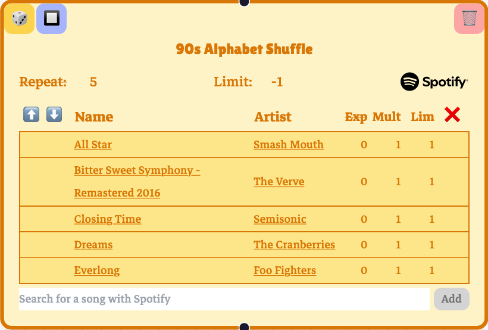
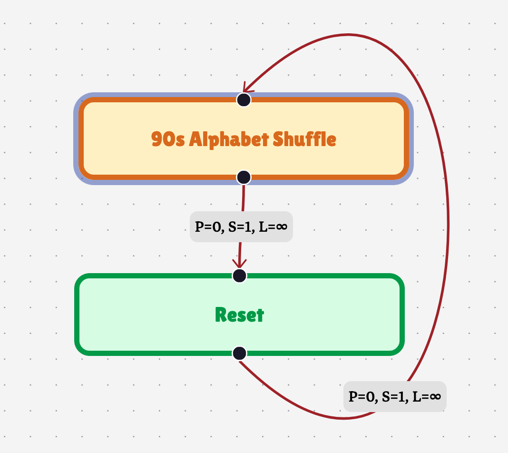
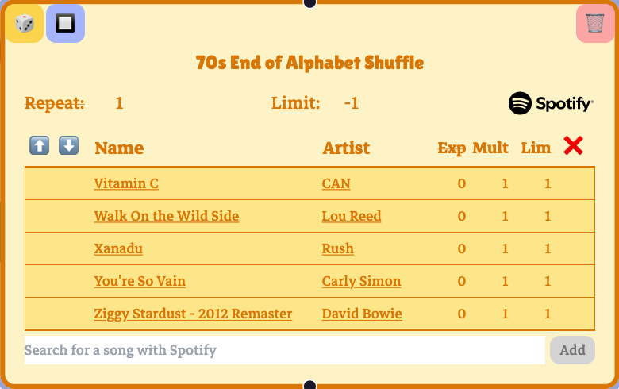
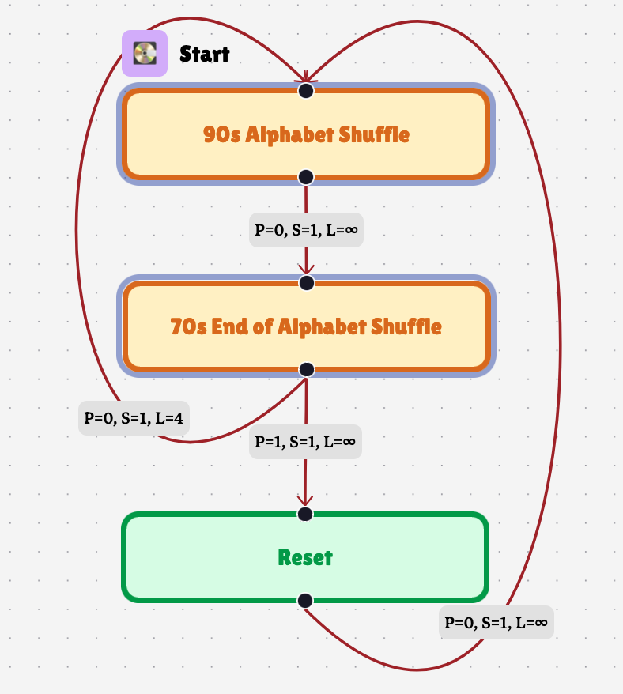
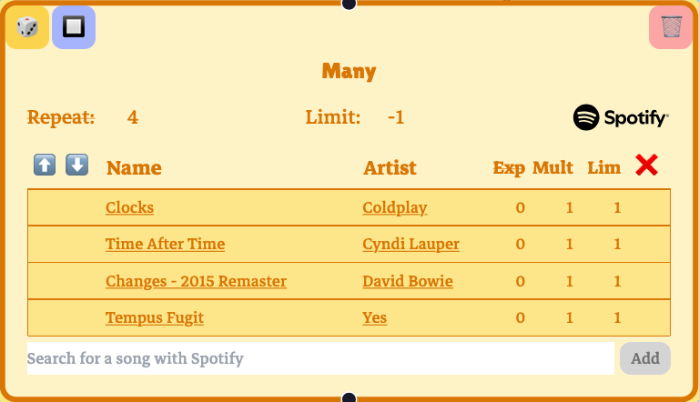
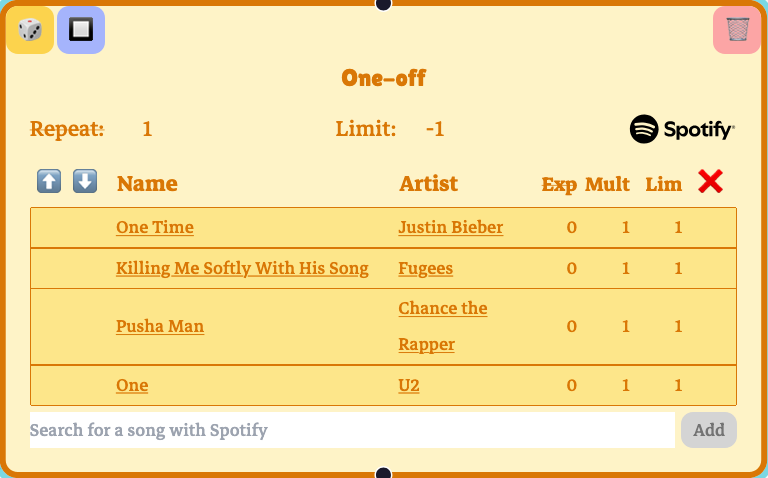
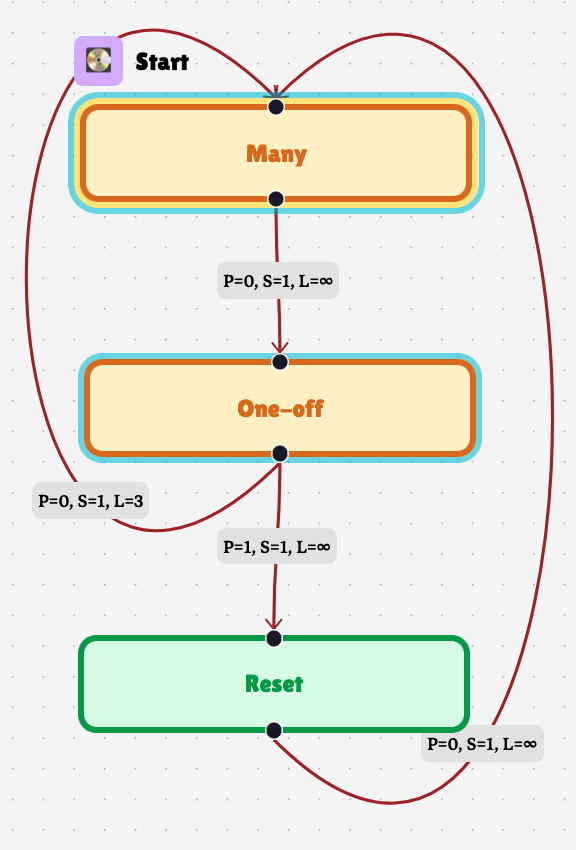

+++
date = '2025-03-22T19:34:08-07:00'
draft = true
title = 'Playtree Playscopes Explained'
+++

### Shuffle
You can make a shuffle playlist in Playtree with a selector:

Each song is limited to one play, and the node is set to repeat five times. This means the selector will play all five songs in a random order, just like a shuffle playlist.

But, by default, the counters that manage limiting plays during playback are *global*: if you go back to this playnode later, all of the songs will still be limited.

### Playscopes

If you want to run through a shuffle again, you'll want to use a *playscope*. A playscope defines a subregion of the playtree where play counters are contained. Any counters keeping track of playnodes, playedges, or songs are reset once playback exits the playscope the counters fall within.

Let's update our shuffle so it can shuffle more than once:

The blue box around "90s Alphabet Shuffle" is a playscope. The "Reset" playnode has no songs: it exists to allow playback to exit the blue scope, resetting the play counters on the shuffle songs. Letting this play through will shuffle the five songs, shuffle the five songs again in a different order, and so on, indefinitely.

Playscopes can apply to multiple playnodes. Let's add another shuffle playnode:

and make a "zipper shuffle" out of these two playlists: randomly play one song from the 90s playlist, then randomly play one song from the 70s playlist, then choose a different song from the 90s playlist, then choose a different song from the 70s playlist, etc.

Playback cycles between the two selectors five times, all the while staying in the blue playscope. Then, the playedge from "70s..." to "90s" is limited, and the playedge to "Reset" is followed. The "Reset" playnode is not in the blue playscope, and so all of the counters in the blue playscope are reset to `0`. This includes the playedge that was limited to `4`. Playback passes through the empty "Reset" playnode to "90s...," which starts the zipper shuffle all over again.

---

### Nested Playscopes

You can have any number of playscopes in a playtree. There a rules that restrict how playscopes can overlap one another, though.

The first rule is that two playscopes can't have exactly the same playnodes. Counters that track plays for playnodes, playedges, and songs have to unambiguously land within one playscope. If two playscopes had exactly the same playnodes, there'd be no sensible way to choose between them. Similarly, two playscopes aren't allowed to overlap *partially*. Again, there's not a sensible way to unambiguously assign a playscope to a playnode that falls in the intersection of two partially overlapping playscopes.

Two playscopes *are* allowed to overlap, though, if one playscope completely and strictly contains the other. That is, the set of playnodes \(S_1\) in one playscope has to be a strict subset of the set of playnodes \(S_2\) in the other playscope—\(S_1 \subset S_2\). In this case, \(S_1\) is the more *specific* playscope. The counters in a playnode get assigned to the most specific playscope. If playback enters a more specific playscope from a less specific playscope that contains it, the counters from the less specific playscope aren't reset yet.

A playedge's counters get assigned to the most specific playscope shared by both its source and target playnode.

Every playnode falls into the "global" playscope by default. It's the least specific playscope, and every custom playscope is contained within it. You might get an error if one of your playscopes contains every playnode. That's because it breaks the first rule: it's exactly the same as the global playscope.

Let's take an example to make things clearer. Instead of making a zipper shuffle, let's make a "stacked shuffle." In a stacked shuffle, one playlist will shuffle all of its songs in one go, pass playback to another playlist which randomly chooses one song to play. Then, the first playlist shuffles all its songs again, and the second playlist picks its second song in the shuffle to play, repeating this process until all songs in the second playlist have played through.

There are two playscopes, cyan and yellow. The cyan playscope contains the "Many" and "One-off" playnodes, and the yellow playscope just contains "Many." The counters for the songs in "Many" get assigned to the yellow playscope, because it's more specific than the blue playscope. The playcounters for the songs in "One-off" get assigned to the cyan playscope.

The "Many" playnode shuffles through all its four songs, and passes playback to "One-off." At this point, the yellow playscope is exited, so the counters for the songs in "Many" are reset. "One-off" selects one song to play, and passes playback to "Many." Although the yellow playscope is *entered*, the cyan playscope isn't *exited*, and so the counters for the songs in "One-off" *don't* reset. Whichever song was chosen stays limited and won't be selected the next time "One-off" plays.

The playedge from "One-off" to "Many" is limited so that "One-off" only plays four times. The playedge's counter is assigned to cyan scope, which is the most specific scope shared by both "Many" and "One-off." After the fourth time "One-off" plays, the playedge is now limited, and so the playedge to "Reset" is chosen. Playback exits the cyan scope, and so the counters for the songs in "Many," the songs in "One-off," and the playedge in between are all reset. Playback passes through "Reset" and goes to "Many," starting the whole stacked shuffle over again.

Having an empty "Reset" playnode is useful, especially for illustration, but it isn't the only way out of a playscope. Playback could exit a playscope and play a whole bunch of other stuff before coming back to a shuffle, and things will still work the same.
