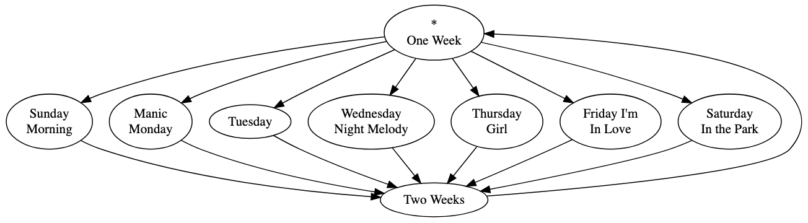
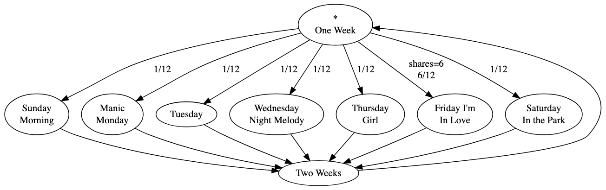
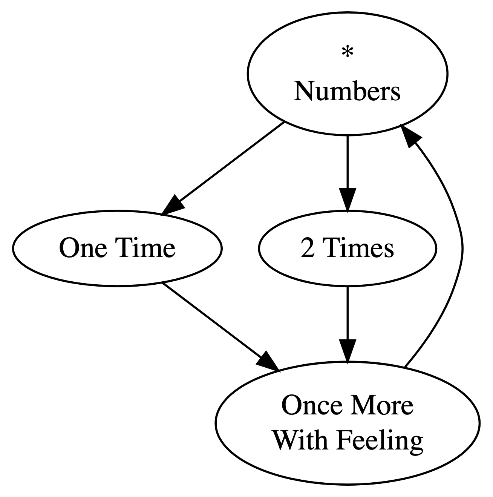
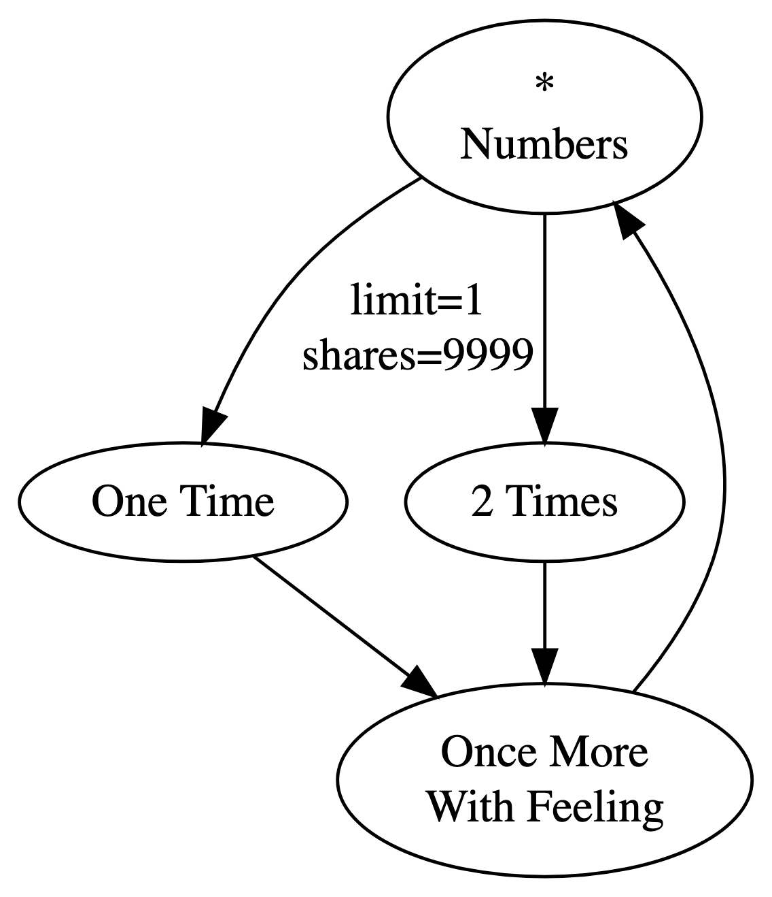
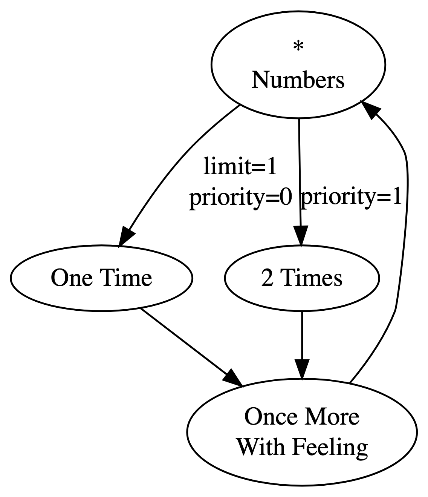
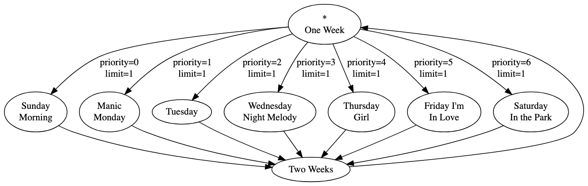

+++
date = '2025-03-21T22:10:46-07:00'
draft = true
title = 'Playtree Shares and Priority Explained'
tags = 'explainer'
[params]
    rank = 101
+++

In this post I'll explain *shares* and *priority*, parameters that apply to playedges. It presumes a familiarity with basic probability and the concept of mathematical limits.

We have to refer to incoming edges a lot, so I'll use "=> playnode" as a shorthand for talking about the playedge that leads into the named playnode.

---

### Shares

This playtree will play "One Week," and then randomly select one of the day songs. "One Week" has seven outgoing playedges, and so, by default, each one has a `1/7` chance of being selected.

You like all these songs, but you're a big fan of The Cure, and so you want "Friday I'm In Love" to be selected more often than one in seven. To skew the odds, you could add duplicate playnodes for "Friday I'm In Love." If you added five more copies of that playnode, the chance of its being selected would go up to `6/12 = 1/2`. But you'd have to wire up the edges for each of them, and you couldn't set a consistent limit for them if you wanted to. 

Conveniently, you can set the playedge's *shares* parameter instead. The name "shares" is meant to evoke shares in a raffle; giving a playedge more shares increases its odds of winning the "playback lottery." Take "=> Friday I'm In Love" and set its shares to `6`. The chances of selecting that playedge rise up to `6/12 = 1/2`, and the other six edges each have a `1/12` chance of being selected.

The formula for a playedge \(e_i\)'s probability of being selected from a set of outgoing edges \(OE\) is

\[
\begin{aligned}
\frac{shares_{e_i}}{\sum_\limits{e \in OE}shares_{e}}
\end{aligned}.
\]

That is, the probability is the playedge's own shares, divided by the total shares across all the outgoing edges.

You can set a playedge's shares to `0`. This will mean that a playedge is never selected. When a playedge reaches its play limit, you can think of its shares as being set to `0`.

---

### Priority

Let's say you really wanted "One Time" to be selected first, once, and then "2 Times" to be selected next. How could you achieve this? Well, you could limit "=> One Time" to `1`, and set its shares to a really high value:

This playtree is *very likely* to do what you want; the probability is `9999/10,000`. But once every ten thousand runs or so, it will choose "=> 2 Times" first instead. You could keep adding shares, and it'll become more and more of a sure thing to work as expected.

But it won't ever be *guaranteed*. The likelihood of selecting the right playedge approaches `1` but never quite reaches it. If, instead, we could take the *limit* of this process, we could get our guarantee:

\[
    \lim_{N \to \infty} \frac{N}{N + 1} = 1.
\]

Equivalently, we could follow a similar limiting process by making the share value for "=> 2 Times" smaller and smaller, approaching zero. (Note that in Playtree, shares must be natural numbers, but we can imagine them as taking values between \(0\) and \(1\) for the sake of this explanation.) If "=> One Time" has one share, the equivalent limit would be as follows:

\[
    \lim_{x \to 0} \frac{1}{1 + x} = 1.
\]

It's this second limit that undergirds *priority*, another playedge parameter. Only the playedges with the lowest priority are eligible for selection. Playedges with higher priority have to wait until the lower priority playedges are limited.

(Note that "lower priority" here means the priority *value* is lower, not that it has lower priority in the colloquial sense of the term. The opposite is true: a playedge with a lower priority value is given *higher* priority in selection.)

We can add priority values to the playedges in our playtree:

Now "=> One Time" has the lowest priority, so it is always selected first. Since its limit is set to `1`, the next time around, it's taken out of contention. Because it's now the lowest priority playedge in contention, "=> 2 Times" is now eligible for selection. It's chosen, and plays this second time around, just like we wanted.

If there are multiple playedges tied for the lowest priority value, they're randomly selected according to the shares, as usual. All of them must be limited before any higher priority playedges are selected.

The playedge selection formula can be revised to accommodate priority as follows: the probability that a playedge \(e_i\) is selected from a set of outgoing playedges \(OE\) is

\[
\begin{aligned}
\lim_{x \to 0}\frac{x^{\rho_{e_i}} * shares_{e_i}}{\sum_\limits{e \in OE} x^{\rho_{e}} * shares_{e}}
\end{aligned},
\]

where \(\rho_{e}\) is the priority value of playedge \(e\). The limit of a rational function approaching \(0\) is the fraction of its lowest degree coefficients. If the numerator doesn't have a term with as low a degree as the denominator does, the limit will evaluate to \(0\). What that means for us is that a playedge that doesn't have the lowest priority will have a probability of \(0\), and a playedge with the lowest priority is selected with the familiar probability: its shares, divided by the total shares from all the playedges tied for lowest priority.

Let's work this out with our example. The first time through, the probability of selecting "=> One Time" is

$$\lim_{x \to 0} \frac{x^0 * 1}{x^0 * 1 + x^1 * 1} = \lim_{x \to 0} \frac{1}{1 + x} = 1,$$

and the probability of selecting "=> 2 Times" is

$$\lim_{x \to 0} \frac{x^1 * 1}{x^0 * 1 + x^1 * 1} = \lim_{x \to 0} \frac{x}{1 + x} = 0.$$

So, "=> One Time" is selected. That playedge reaches its play limit. Recall that you can treat a limited playedge as having zero shares. Now, let's use the formula for the next time around. The probability of selecting the limited "=> One Time" is

$$\lim_{x \to 0} \frac{x^0 * 0}{x^0 * 0 + x^1 * 1} = \lim_{x \to 0} \frac{0}{x} = 0,$$

and the probability of selecting "=> 2 Times" is

$$\lim_{x \to 0} \frac{x^1 * 1}{x^0 * 0 + x^1 * 1} = \lim_{x \to 0} \frac{x}{x} = 1.$$

With priority, we can impose a sequential order on selection. Let's go back to our "days of the week" playtree and add priority values:

Now, "=> Sunday Morning" is selected first, then "=> Manic Monday," and so on, until, finally, "=> Saturday in the Park" is selected.
