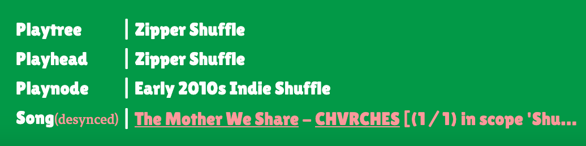
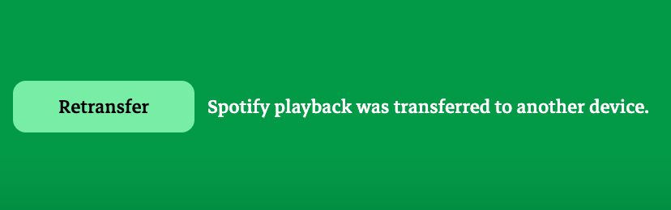

+++
date = '2025-03-19T15:23:36-07:00'
draft = true
title = 'Playtree Spotify Integration'
tags = ['playtree', 'challenge']
[params]
    rank = 20
+++
Playtree uses the [Spotify API](https://developer.spotify.com/documentation/web-api) to search for tracks on Spotify, and to play music within Playtree. It also makes use of the [Spotify Web Playback SDK](https://developer.spotify.com/documentation/web-playback-sdk), which allows for Spotify playback to occur within the app itself, and for certain events pertaining to Spotify playback to be reported real-time to the application.

---

### Authentication

Spotify API calls must be authenticated, and so I use the Authorization Code flow to obtain an access token from the server side. I need to use the access token on both the client and the server. Web Playback SDK can only be used client-side, and my server uses Spotify tokens as a proxy for the user's identity within the site. Access tokens and refresh tokens are stored as cookies.

---

### Synchronizing the playtree player with the Spotify playback state

The Playtree client can control Spotify playback, but playback can be controlled in certain ways on other Spotify clients as well. Playback can be transferred from the web player device to another device, a user can change the song that's playing on Spotify manually on the Spotify client, they can turn on loop mode, etc.

The web player emits events when some of these changes occur, and at that point, the Playtree player state can be compared to the Spotify state as reported by the web player. With that comparison, Playtree can report when playback has gotten out of sync with Spotify, and offer the user the option to resync. When the user chooses a song outside of the playtree on another Spotify client, they get the following message:

If the user selects a different device than the Playtree web player, they look their UI and get the following message:

A subtle challenge has to do with Playtree's preferred playback flow versus Spotify's preferred flow. Spotify prefers for a user to set up a context—a playlist or an album, for example—and to automatically queue up upcoming songs to play next. Spotify even has an autoplay feature which will play related songs once a context is completed.

Playtree, on the other hand, prefers for songs to be loaded individually, only selecting the next song to play once the current song is over. A user can see on their Spotify queue what songs are coming up next; because randomness is so central to Playtree, the song selected to play next should be a surprise to the user when it first starts playing. Also, if development on this project continues, a nice feature would be to allow the user to manually override random selection of the next song; thus, the next song should be left open throughout the course of the current song's playtime. Still, playback should move more or less seamlessly from one song to the next.

To integrate this just-in-time approach with Spotify, I had to be resourceful. I didn't want to poll the Spotify `/me/player` endpoint, because Spotify API calls are rate-limited. Also, I didn't want to rely on a timeout function, changing the song once the duration of the current song had elapsed. The timeout could easily get out of sync with the actual state of the Spotify player.

What was left at my disposal were the events emitted by the Spotify web player. Unlike HTML `<audio>` elements, the Spotify web player doesn't come with a dedicated `ended` event; rather, a song's completion must be inferred from other properties of playback. Certain features reliably correlated with a track's completion: the same song would be playing, except its playback would be reset to 0 and playback would be paused. I also store a timestamp on the Playtree playhead of the last time synchronized playback on a song was started. If the time elapsed since starting playback matches the time remaining on the current song, and a playback event with the right features is received, it is inferred that the song is over and that a new song should be selected.

Also, "loop" mode is automatically toggled off if a user ever turns it on while Playtree is playing. It interferes with determining a song's completion.

There are some issues synchronizing Playtree with Spotify that are unavoidable. API calls can't activate Spotify playback, so a user has to make sure they play a little Spotify a little before using Playtree. Still, Playtree accounts for many of the ways external changes might interfere with the desired Spotify playback.
