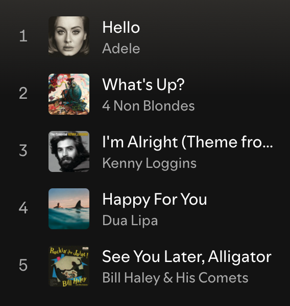
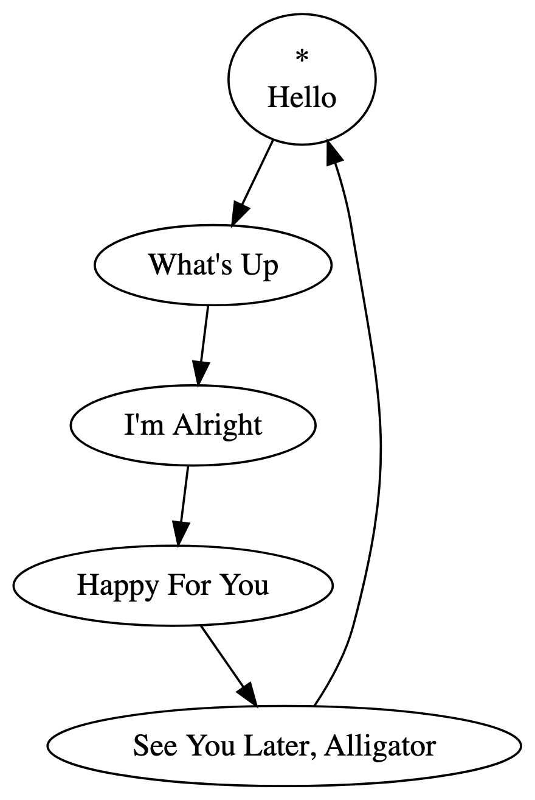
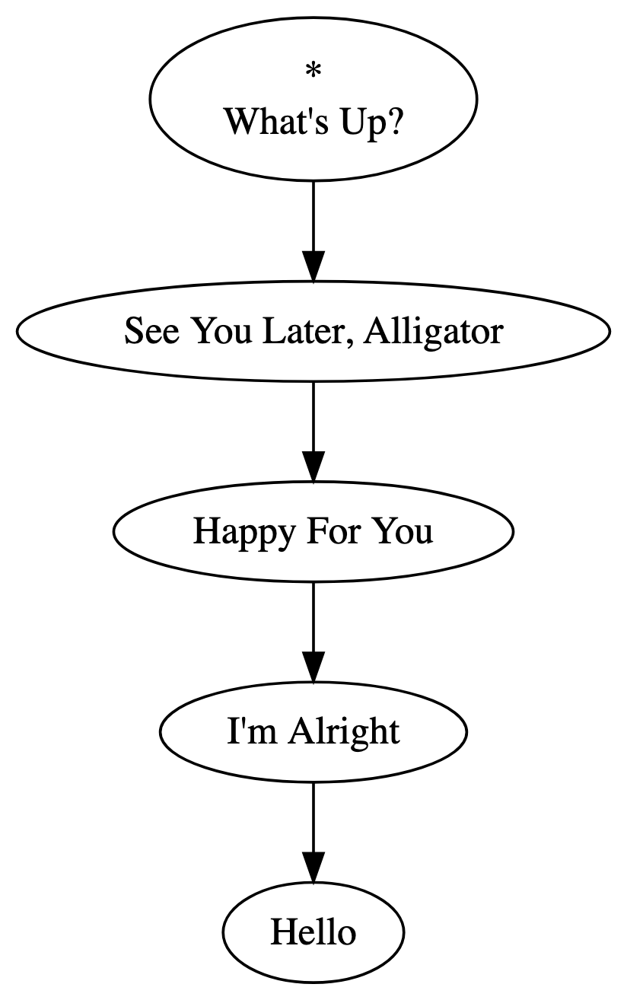
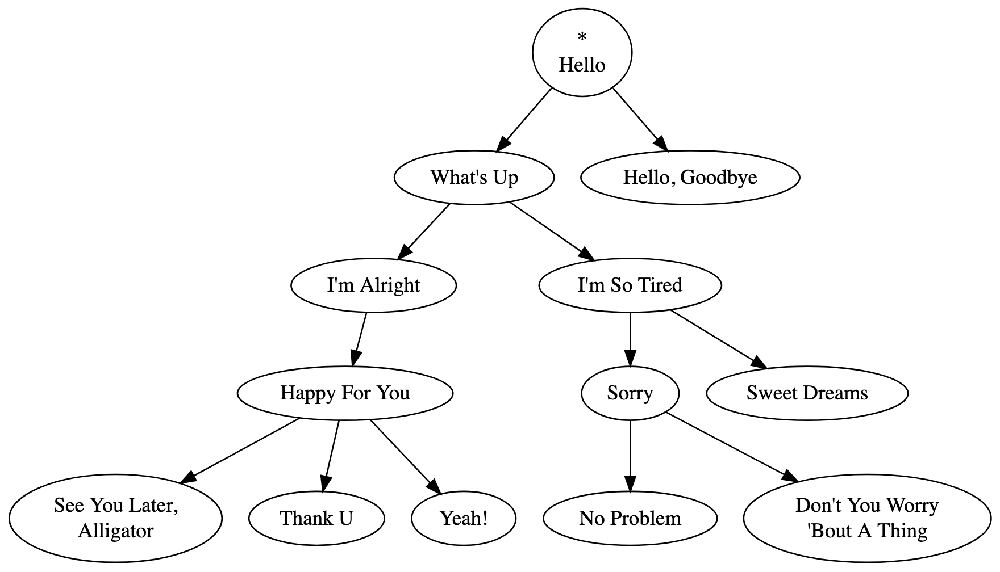
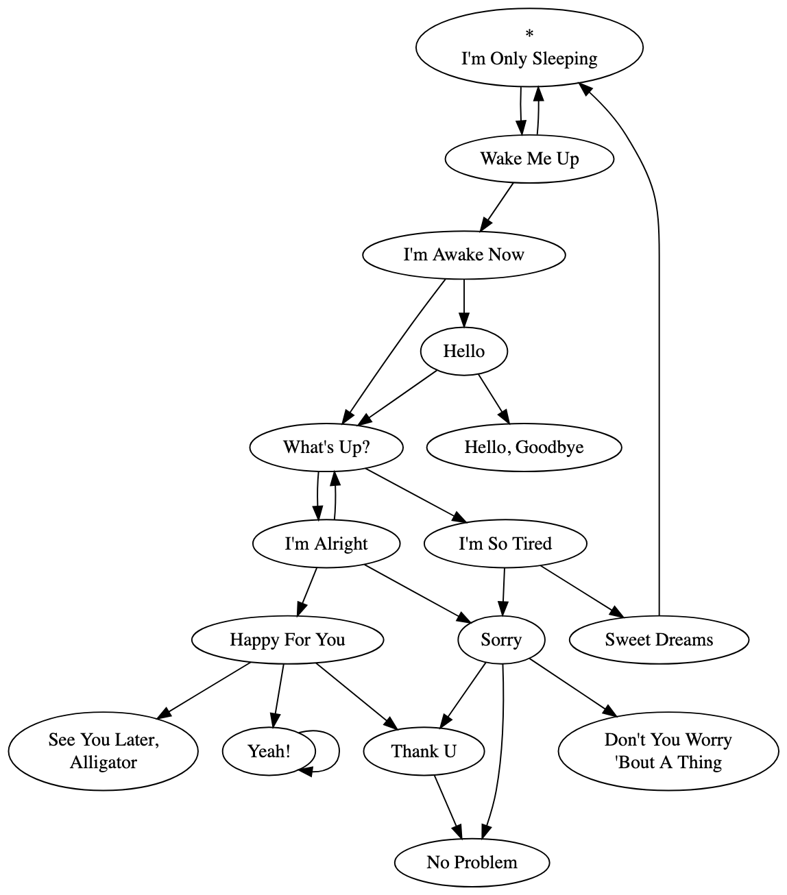
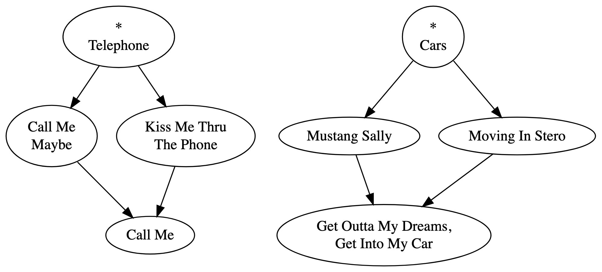
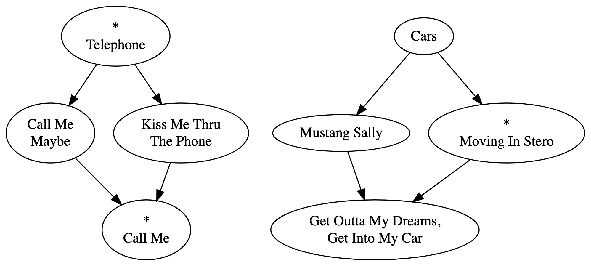

+++
date = '2025-03-20T12:28:54-07:00'
draft = true
title = 'Playtree Structure Explained'
+++

In this article, I'll explain what a playtree structure is, and discuss some of the extra features added to my implementation of playtrees. A basic familiarity with sequences and cycles, trees, graphs, and linked lists is assumed.

There's no doubt you're familiar with playlists. Let's take an example of one on Spotify:

If you play this playlist without shuffle or loop toggled on, it will start playing "Hello." After "Hello" finishes, "What's Up?" will start playing. Then, "I'm Alright." This will carry on until "See You Later, Alligator," the last song in the playlist, finishes. After that, playback stops. We can model the playlist's playback behavior with the following directed graph:

The songs of the playlist are contained within nodes. When playback reaches a node, the node's song plays.  After the song in a node is finished playing, playback moves along the directed edge to the next node.

Playback starts with "Hello," designated with the asterisk (*). Playback ends once "See You Later, Alligator" finishes: because playback has no edge to follow, playback terminates.

This model of a playlist is a special kind of graph called a [*path graph*](https://en.wikipedia.org/wiki/Path_graph), and could be implemented with a [linked list](https://en.wikipedia.org/wiki/Linked_list) data structure. In this way, playlists are aptly named. Playback moves from the start of the list, to the next node, to the next, and so on, until it reaches the end of the list. If we were to toggle the loop button on this playlist, playback would continue from the last song, "See You Later, Alligator," to the first song, "Hello." Playback would look like this:

Now, we have a [*cycle graph*](https://en.wikipedia.org/wiki/Cycle_graph), wherein playback continues indefinitely, moving from one node to the next. This could be implemented with a [circular linked list](https://en.wikipedia.org/wiki/Linked_list#Circular_linked_list).

If we had shuffle mode toggled, we'd end up rearranging the nodes of the list and reassigning the starting point. One possible shuffle of our original playlist looks like this:

Let's think about these path and cycle graphs in terms of their essential constraints. Every node must have exactly one edge going out, except the last node, which has none, if loop mode is toggled off. And every node must have exactly one edge coming in, except the starting node, which has none, if loop mode is toggled off. And no node can have a [*loop*](https://en.wikipedia.org/wiki/Loop_(graph_theory)): an edge that connects from a node to itself. What if we lifted these constraints? What kind of playback behavior could follow from that?

Let's start by allowing every node to have any number of edges going out. Then, we could make tree structures like this:

How will playback progress once it finishes at a node with multiple outgoing edges? There isn't only one way to define its behavior. We could have it that playback "splits" and plays both of the next nodes at the same time. But as I've defined it, playback progresses by randomly selecting one of the edges to follow.

In this example, playback starts at "Hello." After "Hello" finishes, playback randomly selects an edge to follow, and may end up at either "What's Up?" or "Hello, Goodbye". If "Hello, Goodbye" is chosen, the node has no outgoing edges, and so playback ends after the song finishes. Let's suppose instead that "What's Up?" is selected. Playback moves to "What's Up?" and, after it's done playing, either of "I'm Alright" or "I'm So Tired" is selected at random. Suppose "I'm Alright" is chosen. Because there is only one outgoing edge, playback automatically moves to "Happy For You." After it plays, one song among "See You Later, Alligator," "Thank U," and "Yeah!" is selected, it plays, and then playback ends.

Notice that this kind of branching behavior, where playback branches randomly but with a consistent structure, cannot be replicated with a playlist, even with shuffle. In a playlist, you either move along in the predefined order, or else you play every song in the playlist in a totally random order. This new kind of playback structure merits its own name beyond a play*list*—let's call it a **playtree**!

We can go further and lift another constraint. We can allow every node to have any number of edges coming in. Also, let's allow loops (self-connecting edges). Here's an example graph structure made possible with those constraints lifted:

Notice how multiple nodes can pass playback on to the same node, e.g. "Thank U" and "Sorry" to "No Problem." Also, cycles are now allowed: "Yeah!" passes playback back to itself, looping the song indefinitely once it is reached. The first song moves to "Wake Me Up", which might go back to "I'm Only Sleeping" or else progress to "I'm Awake Now."

(Technically, cycles were possible even when we lifted the first constraint on outgoing edges. The "root" node of the tree had no incoming nodes, so it, like a cycle graph, could have admissibly been given an incoming edge from one of the "leaf" nodes with no outgoing edges. But only one such cycle was allowed under that set of constraints, and now any number of cycles can occur, anywhere within the graph.)

Now, at this point, by analogy with playlists and playtrees, I should call these structures *playgraphs*. But I still call them playtrees, even though playtrees aren't always trees. Playtree just has a certain ring to it.

Each of our examples so far have made an implicit assumption. There has been at least one node in our graphs that can reach every other node. We've designated one of these nodes as the "start" node with an asterisk. This is a sensible assumption: after all, playback has to start *somewhere*, and if we add a song to our graph, we probably want there to be at least *some* chance for it to be played, some chance that playback finds its way to it.

But what if we ignored even *this* assumption? Our graphs could look like "islands" instead. But, keep in mind that we want to make sure the nodes we put into the graph have a chance at being played. So, we allow for multiple starting points:

How exactly does having multiple starting points affect playback behavior? Again, it's partly a matter of stipulation. In Playtree, starting points (called "playroots") can be assigned to any number of nodes, and they are given an index. When a user first plays a playtree, a playhead is created for each playroot. A playhead manages a playback context independent from every other playhead. Playheads are ordered according to the playroot index, and each playhead starts at the node a playroot was assigned to. When playback in a playhead reaches a stopping point, the playhead is reset, and playback is automatically passed to the next playhead by index. The user can also move between playheads with their Playtree controls. Think of it like switching between car CDs.

In this case, let's suppose that the playroot assigned to "Telephone" has index 0, and the playroot assigned to "Cars" has index 1. When a user plays this playtree, playback will start at "Telephone," end at "Call Me," reset, and then pass playback on to the playhead starting at "Cars." After "Get Outta My Dreams, Get Into My Car" finishes, the playhead resets and passes playback on to the playhead at "Telephone." Because this playhead has already played through and stopped, playback is stopped until the user decides to start playback again.

Usually, your playtrees end up such that every node is reachable by exactly one playroot. But that's not enforced by Playtree. Consider the following playtree:

This playtree is valid, even though it has an arguably redundant playroot assigned to "Call Me," and even though "Cars" and "Mustang Sally" are not reachable from any playroot. A user editing a playtree will be warned if a node isn't reachable, as this might be a mistake, but the playtree is still valid nonetheless.
